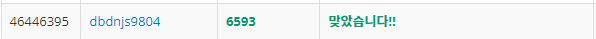
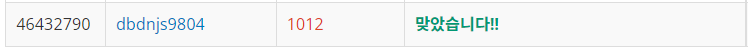

# Week 4


## 상범 빌딩(https://www.acmicpc.net/problem/6593)

1. 문제 요약
   
```
L x R x C 크기 3차원 공간의 빌딩안에서 시작지점S에서 출발하여 벽을 제외한 길을 통해서만 도착지점 E의 최단거리를 구하는 문제
```

2. 푸는 과정

```
1) while문을 통해 테스트케이스의 마다 각각의 입력값들을 저장한다.
2) 이때 각각 공간의 정보를 가진 문자들을 <string>의 substr을 통해 슬라이싱하여 숫자로 치환하여 3차원 배열에 저장한다.
3) BFS탐색을 하는 도중, 거리배열을 통해 각 위치의 3차원 배열에 대한 이동거리를 저장한다.
4) 탐색위치가 도착지점일때의 거리배열 값을 결과값으로 저장하여 출력한다.
```

3. 총평 및 주의사항

```
3차원 토마토 문제에서 최단거리와 여러 테스트케이스가 추가된 문제였다.
```

1. 결과

```
정답여부: 정답, 소요시간: 100분
```


## 유기농 배추(https://www.acmicpc.net/problem/1012)

1. 문제 요약
   
```
N x M 크기의 재배소에 위치한 배추들에 필요한 지렁이(인접한 배추들에게 퍼지는 특성)의 최소 마리수를 구하는 문제
```

2. 푸는 과정

```
1) DFS를 통해 인접한 배출들을 체크한다.
2) DFS를 for문을 통해 반복하여 탐색해 인접한 배추의 그룹 수를 구한다.
3) DFS탐색을 반복할 때 한번 탐색한 배추의 위치는 제외한다.
```

3. 총평 및 주의사항

```
2주차에 풀었던 DFS 문제와 유사하여 풀기는 쉬웠으나 테스트케이스의 수를 지정하거나 좌표를 헷갈리는 등의 추가로 고려할 사항이 있었다.
```

4. 결과

```
정답여부: 정답, 소요시간: 35분
```
