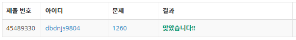
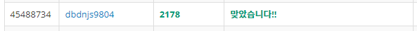

# Week 1


## DFS와 BFS(https://www.acmicpc.net/problem/1260)

1. 문제 요약
   
```
정점과 간선이 주어지고 DFS, BFS탐색을 각각 이용하여 정점을 방문하는 문제.
```

2. 푸는 과정

```
1) 벡터형 배열을 생성하여 N, M, V에 따른 테스트 케이스를 입력받아 저장한다.
2) algorithm sort정렬을 이용하여 각 벡터에 할당된 케이스를 오름차순으로 정렬한다.
3) DFS와 BFS정렬을 통해 각각 탐색한다. 이때, 체크 배열을 생성하여 방문한 정점을 탐색 리스트에서 제외하며 탐색한다.
4) 그 결과를 출력한다.
```

3. 총평 및 주의사항

```
DFS와 BFS를 이해하는데 도움이 되었다.

각 탐색방법을 처음 접해보았기 때문에 탐색방법을 이해하는데 의의를 두었다.
```

4. 결과

```
정답여부: 정답, 소요시간: 120 (영상시청 공부포함)
```



## 미로탐색(https://www.acmicpc.net/problem/2178)

1. 문제 요약

```
0과 1로 이루어진 N x M 미로를 1을 통해서만 (0, 0)의 좌표에서 (N, M)의 좌표까지 도달하는 최소거리를 구하는 문제. 
```

2. 푸는 과정

```
1) string을 생성하여 N, M 에 따른 테스트 케이스를 입력받아 저장한다.
2) 테스트케이스를 substr을 통해 파싱하여 배열에 정점개념으로 저장한다.
3) 이때, 접하는 부분과 접하는 부분이 없는 케이스를 조건문으로 에러처리하여 정점간 간선 개념으로 벡터형 배열에 저장한다.
4) 주어진 간선을 이용하여 BFS 최단거리 알고리즘으로 거리를 출력한다. 
```

3. 총평 및 주의사항

```
BFS를 응용하여 풀면  접근하기 쉬운 문제였다.

작성자의 풀이방법과는 다르게 table과 pair를 이용하여 코드를 간결화 할수 있다는 점이 인상깊었다.
```

4. 결과

```
정답여부: 정답, 소요시간: 140분
```
