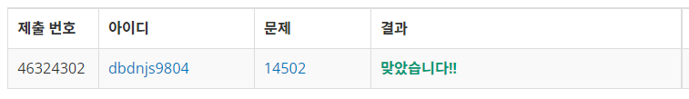

# Week 3


## 연구소(https://www.acmicpc.net/problem/14502)

1. 문제 요약
   
```
N x M 크기의 연구소 안에서 퍼지는 바이러스를 격리시킬 벽을 세개 설치하여 최대 안전구역을 구하는 문제.
```

2. 푸는 과정

```
1) 벡터형 배열을 사용하여 벽 그룹으로 가능한 인덱스들을 간선처리한다.
2) DFS를 통해 생성 가능한 벽의 위치를 모두 구한다.
3) DFS함수 안에서 가능한 벽의 위치를 구할 때마다 BFS를 통해 바이러스가 퍼지는 크기를 구한다.
4) 최대값을 최신화하며 가장 큰 안전구역의 크기를 구한다.
```

3. 총평 및 주의사항

```
DFS와 BFS를 동시에 사용하는 문제라는것이 인상 깊었다.
DFS의 재귀성을 이용하여 문제를 접근하였는데 return 되는 위치를 적절히 설정하며 에러처리 하는것이 쉽지 않았다.
```

4. 결과

```
정답여부: 정답, 소요시간: 300
```
