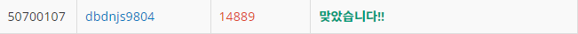

# Week 12


## 스타트와 링크(https://www.acmicpc.net/problem/14889)

1. 문제 요약
   
```
N명(짝수)의 인원이 N/2명씩 팀을 이루어 축구경기를 할 때, 두 팀의 각 팀원에의해 결정되는 능력치의 합의 차의 최소값을 구하는 문제. 
```

2. 푸는 과정

```
1) N X N 크기의 2차원 배열에 팀원간의 상호 능력치를 저장한다.
2) 팀원의 번호를 벡터에 저장하여 nCn/2 조합(가능한 팀 조합)을 구하여 벡터에 저장한다.
3) 가능한 팀에서의 nC2 조합(상호 능력치 계산을 위한 2명의 조합)을 구하여 각 조합에 해당하는 상호능력치를 모두 더한다.
4) 위 과정을 (nCn/2)/2만큼 반복한다.
5) 각 반복마다 구해진 각 팀의 능력치합의 차이의 절댓값의 최소값을 출력한다.
```

3. 총평 및 주의사항

```
- 재귀함수를 이용한 다양한 조합을 구하는 문제.
- 무조건 두 팀이 형성돼 nCn/2에는 중복된 조합이 발생하므로 (nCn/2)/2 만큼만 반복한다.
```

1. 결과

```
정답여부: 정답, 소요시간: 130분
```
