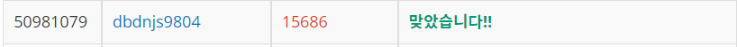

# Week 8


## 치킨 배달(https://www.acmicpc.net/problem/15686)

1. 문제 요약
   
```
N X N 크기의 도시에서 M개의 치킨집을 골라 집과 치킨집 사이의 최단거리 합을 구하는 문제.
```

2. 푸는 과정

```
1) 2차원 배열에 도시의 정보를 저장한다.
2) 조합을 통해 도시의 치킨집 개수에서 M개만큼의 치킨집을 뽑는다.
2) BFS탐색을 통해 치킨집에서 집과의 거리를 구한다.
3) 집과의 거리를 모두 더해 치킨거리를 구한다.
```

3. 총평 및 주의사항

```
BFS탐색에서 치킨집에서 치킨집을 탐색하는것을 예외처리한다.
```

1. 결과

```
정답여부: 정답, 소요시간: 80분(재도전)
```
