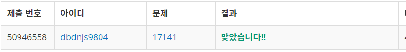

# Week 13


## 연구소 2(https://www.acmicpc.net/problem/17141)

1. 문제 요약
   
```
NXN크기의 연구소에서 바이러스의 발원지를 M개만큼 골랐을 때 바이러스가 모두 퍼지는 시간의 최소값을 구하는 문제. 
```

2. 푸는 과정

```
1) N X N 크기의 2차원 배열에 연구소의 정보를 저장한다.
2) 바이러스를 위치시킬 수 있는 장소의 개수에서 M개를 뽑는 조합을 재귀함수를 통해 구한다.
3) 조합의 개수만큼 반복하여 바이러스가 퍼지는 과정을 BFS를 통해 구현한다.
4) 반복시 바이러스가 모두 퍼지는 시간을 저장한다.
5) 반복이 끝나면 바이러스가 모두 퍼지는 시간의 최소값을 출력한다.
```

3. 총평 및 주의사항

```
- 조합과 BFS 구현
```

1. 결과

```
정답여부: 정답, 소요시간: 120분
```
