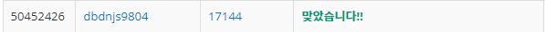

# Week 11


## 미세먼지 안녕!(https://www.acmicpc.net/problem/17144)

1. 문제 요약
   
```
R X C 크기의 방에서 다음 조건을 만족하는 과정 이후 남은 미세먼지의 수를 구하는 문제. 

1. 미세먼지가 확산된다. 확산은 미세먼지가 있는 모든 칸에서 동시에 일어난다.
    * (r, c)에 있는 미세먼지는 인접한 네 방향으로 확산된다.
    * 인접한 방향에 공기청정기가 있거나, 칸이 없으면 그 방향으로는 확산이 일어나지 않는다.
    * 확산되는 양은 Ar,c/5이고 소수점은 버린다.
    * (r, c)에 남은 미세먼지의 양은 Ar,c - (Ar,c/5)×(확산된 방향의 개수) 이다.
2. 공기청정기가 작동한다.
    * 공기청정기에서는 바람이 나온다.
    * 위쪽 공기청정기의 바람은 반시계방향으로 순환하고, 아래쪽 공기청정기의 바람은 시계방향으로 순환한다.
    * 바람이 불면 미세먼지가 바람의 방향대로 모두 한 칸씩 이동한다.
    * 공기청정기에서 부는 바람은 미세먼지가 없는 바람이고, 공기청정기로 들어간 미세먼지는 모두 정화된다.

```

2. 푸는 과정

```
1) 3차원 배열에 경과한 시간에 대한 각 방의 데이터를 저장한다.
2) R X C 크기의 방에서 미세먼지가 퍼지는 과정을 BFS를 통해 구하고 각 미세먼지 발원지로부터의 미세먼지량을 모두 더하여 다음 시간에 대한 방 데이터에 저장한다.
3) BFS가 종료된 이후에 for문을 이용하여 공기청정기가 순환한 과정을 구현한다.
4) 위 과정을 경과한 시간마다 반복한다.
5) 반복 후 각 인덱스에 저장된 미세먼지를 모두 더한다.
```

3. 총평 및 주의사항

```
미세먼지가 동시에 퍼지는 과정을 구현하기 위해 시간축을 이용하였다.
```

1. 결과

```
정답여부: 정답, 소요시간: 150분
```
