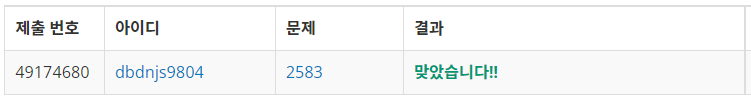
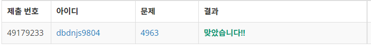

# Week 6


## 영역 구하기(https://www.acmicpc.net/problem/2583)

1. 문제 요약
   
```
M X N 크기의 격자판에 색칠된 영역을 제외한 영역의 개수와 넓이를 구하는 문제
```

2. 푸는 과정

```
1) 2차원 배열에 각 영역에 대한 색칠여부를 0과 1로 구분하여 저장한다.
2) 색칠되거나 한번 탐색한 부분을 예외처리하며 좌표인덱스를 사용하여 BFS반복 탐색을 실행한다.
3) 이때, BFS 내부에서의 카운터를 영역의 넓이, BFS를 반복하는 외부에서의 카운터를 영역의 개수로 저장한다.
4) 영역의 넓이를 <algorithm> 헤더의 sort를 이용하여 오름차순으로 정렬하여 출력한다.
```

3. 총평 및 주의사항

```
좌표의 정의가 왼쪽 아래부터 오른쪽 위라는 점에 유의하며 배열의 행, 열 계산을 시행한다.
```

1. 결과

```
정답여부: 정답, 소요시간: 45분
```


## 섬의 개수(https://www.acmicpc.net/problem/4963)

1. 문제 요약
   
```
w x h크기의 바다 위에 위치한 섬의 개수를 구하는 문제, 하나의 섬으로 인정하는 기준은 상하좌우 또는 대각으로 이동가능한 지형
```

2. 푸는 과정

```
1) 2차원 배열에 각 영역에 대한 섬의 유무를 0과 1로 구분하여 저장한다.
2) 섬이 아니거나 한번 탐색한 섬을 예외처리하며 8가지 경우의 좌표인덱스를 이용하여 BFS반복 탐색을 실행한다.
3) BFS를 반복할때마다 섬의 개수카운터를 증가시켜 섬의 개수를 저장한다.
```

3. 총평 및 주의사항

```
week6_1와 같이 BFS를 반복탐색하는 문제로 8가지의 좌표이동 경우의 수가 존재한다.
```

4. 결과

```
정답여부: 정답, 소요시간: 35분
```
