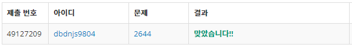
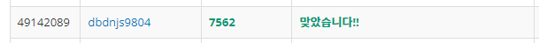

# Week 5


## 촌수계산(https://www.acmicpc.net/problem/2644)

1. 문제 요약
   
```
L x R x C 크기 3차원 공간의 빌딩안에서 시작지점S에서 출발하여 벽을 제외한 길을 통해서만 도착지점 E의 최단거리를 구하는 문제
```

2. 푸는 과정

```
1) 각 가족 구성원에 대한 데이터를 입력받는다.
2) 벡터map을 이용하여 각 구성원 간의 간선을 연결한다.
3) DFS탐색을 통해 모든 경우의 수에 대하여 구성원간의 거리 즉 촌수를 측정하되 한번 탐색한 구성원은 예외처리한다.
```

3. 총평 및 주의사항

```
DFS탐색을 통한 최단거리를 찾는 문제와 유사하나 실제로 쓰이지 않는 데이터가 있어 유의해야한다.
```

1. 결과

```
정답여부: 정답, 소요시간: 35분
```


## 나이트의 이동(https://www.acmicpc.net/problem/7562)

1. 문제 요약
   
```
가로 세로가 같은 정사각형 모양의 체스판 위에서 나이트의 이동방식으로 원하는 좌표까지 이동하는데 필요한 최소 이동 횟수
```

2. 푸는 과정

```
1) 테스트 케이스를 통해 체스판의 크기, 시작좌표, 목표좌표를 입력받는다.
2) 다양한 경우의 수에서 최단거리를 알아내기 위해 BFS탐색을 이용한다.
3) 나이트의 이동방식인 1칸 이동후 수직으로 2칸이동하는 이동방식을 구현하기 위해 8가지 경우의 수의 x, y 좌표인덱스를 통해 탐색한다.
```

3. 총평 및 주의사항

```
기존에 풀어봤던 4방향 좌표이동을 응용하여 다양한 이동 방식을 구현할 수 있다는것이 흥미로웠다.
```

4. 결과

```
정답여부: 정답, 소요시간: 50분
```
