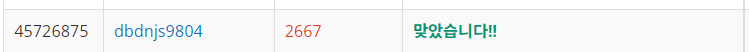
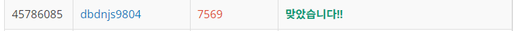

# Week 2


## 단지번호 붙이기(https://www.acmicpc.net/problem/2667)

1. 문제 요약
   
```
정사각형 모양의 미로 위에 위치한 가구를 인접한 가구 별로 단지를 형성하여 단지의 수와 각 단지의 가구를 구하는 문제.
```

2. 푸는 과정

```
1) 벡터형 배열을 생성하여 가구 수 N*N에 따른 테스트 케이스를 입력받아 저장한다.
2) 접하는 부분과 접하는 부분이 없는 케이스를 조건문으로 에러처리하여 정점간 간선 개념으로 벡터형 배열에 저장한다.
3) for문안의 DFS를 통해 인접한 가구를 탐색한다. 이때, 체크 배열을 생성하여 방문한 정점을 탐색 리스트에서 제외하며 탐색한다.
4) 이때, DFS탐색 내부의 가구 탐색이 끝날때 마다 가구 카운터를 올려 가구카운터 배열에 저장하고 한 단지 DFS탐색이 끝날 때마다 단지 카운터를 올린다.
4) algorithm sort정렬을 이용하여 가구카운터 배열을 오름차순으로 정렬한다.
4) 각 카운터들을 출력한다.
```

3. 총평 및 주의사항

```
DFS를 여러번 반복 시켜 탐색하는 방법의 존재와
이때, 불필요한 탐색을 피하기 위해 에러처리하는 것의 중요성을 깨닫게 되었다.
```

4. 결과

```
정답여부: 정답, 소요시간: 90
```



## 토마토(https://www.acmicpc.net/problem/7569)

1. 문제 요약

```
3차원 공간에 토마토가 전부 익어가는 시간을 구하는 문제
```

2. 푸는 과정

```
1) N, M, H 에 따른 테스트 케이스를 입력받아 저장한다.
2) 3차원 공간의 토마토들이 인접한 케이스를 조건문으로 에러처리하여 정점간 간선 개념으로 벡터형 배열에 저장한다.
3) 주어진 간선을 이용하여 BFS을 통해 탐색한다.
4) 이때, BFS 큐의 pop카운터와 push카운터를 통해 토마토가 익어가는 날짜를 카운트한다.
5) 모든 탐색이 끝났을 떄 익지않은 토마토가 있는 인덱스를 에러처리하여 토마토가 모두 익지않은 케이스를 추가하였다.
```

3. 총평 및 주의사항

```
처음에 무지성으로 DFS로 접근했다가 시간초과를 하여
개념을 정리해본 결과 한 날짜에 토마토가 익는 과정을 너비, 다음 날짜를 깊이로 두고 BFS로 접근하는 것이 효율적이라는것을 알았다.
앞으로 코딩전에 설계를 끝내는 습관을 들여야겠다.  
```

1. 결과

```
정답여부: 시간초과 + 정답, 소요시간: 120 + 150분
```
